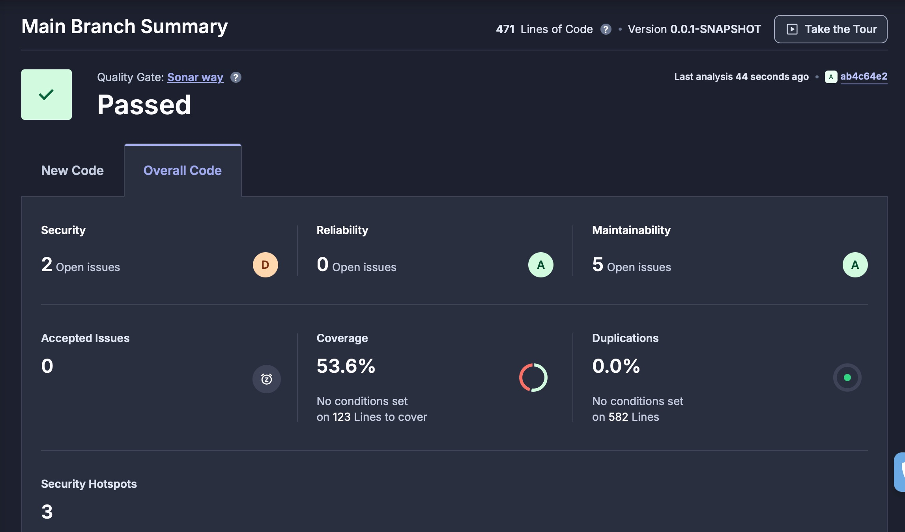

# devops-livecoding
---

### What are testcontainers?
Testcontainers is a Java library that supports JUnit tests, providing lightweight, throwaway instances of common databases, Selenium web browsers, or anything else that can run in a Docker container.

---

### Documentation of the main.yml file

This section documents the GitHub Actions workflow defined in `main.yml` for Continuous Integration.


#### Trigger Conditions (`on`)

The workflow runs when:
- There’s a push to the `main` or `dev` branches.
- Any pull request event occurs.

#### Job (`jobs`)

`test-backend` <br>
This job, named `test-backend`, is configured to run on an `ubuntu-22.04` environment.

#### Steps (`steps`)

The `test-backend` job includes the following steps:

1. **Checkout Code**  
   Uses the `actions/checkout@v2.5.0` action to download the code from the repository to the GitHub Actions runner.

2. **Set up JDK 17**  
   Configures Java Development Kit (JDK) 17 using `actions/setup-java@v3` with Amazon Corretto distribution. This ensures the correct Java environment is available for building the project.

3. **Build and Test**  
   Runs Maven commands (`mvn clean verify`) to build and test the project. The `working-directory` option is specified to indicate the location of the `pom.xml` file.

This workflow supports automated CI checks to ensure that changes to the codebase are tested consistently across `main` and `dev` branches and pull requests.

---

### For what purpose do we need to push docker images?

Pushing Docker images to a registry centralizes storage and ensures consistent deployments across environments. It allows for version control, making rollbacks easy if needed. Integrating Docker images with CI/CD workflows streamlines builds and deployments by automating these steps. In microservices architectures, images enable independent scaling and updates of services.

---

### Document your quality gate configuration.



---

# Ansible

## Project Inventory and Base Commands

### Inventory Structure

In our project (`devops-livecoding/ansible`), the directory structure is set up for an Ansible inventory file, with details for the environment and connection variables. The structure is as follows:

```
devops-livecoding/
└── ansible/
    └── inventories/
        └── setup.yml
```

### Inventory File: `setup.yml`

The `setup.yml` file is an **inventory** for Ansible to define hosts, groups, and specific variables. Here’s a breakdown of its contents.

- **`all:`**  
  The top-level group that contains all hosts and groups in the inventory.
  
  - **`vars:`**  
    Global variables that apply to all hosts in the inventory. Here:
    - `ansible_user`: Defines the SSH user as `admin`.
    - `ansible_ssh_private_key_file`: Path to the SSH private key file (absolute path for reliability).
  
- **`children:`**  
  Defines sub-groups within `all`. Here we define:
  - **`prod:`**  
    A group called `prod` to contain production hosts.
    - **`hosts:`**  
      Lists individual hosts in the `prod` group.

### Base Ansible Commands

1. **Ping All Hosts**  
   Test connectivity to all hosts in the inventory.

   ```bash
   ansible all -i inventories/setup.yml -m ping
   ```

2. **List Hosts in the Inventory**  
   Display all hosts in the `prod` group, as defined in `setup.yml`.

   ```bash
   ansible-inventory -i inventories/setup.yml --list
   ```

3. **View Host Variables**  
   Show variables for a specific host.

   ```bash
   ansible-inventory -i inventories/setup.yml --host hostname_or_IP
   ```
4. **Gather Distribution Facts**  
   Collect detailed information about the distribution of each host (e.g., OS version and name) using the `setup` module with a filter.
   
   ```bash
   ansible all -i inventories/setup.yml -m setup -a "filter=ansible_distribution*"
   ```

## Deployment Documentation

This documentation describes the configuration of each role and task used to deploy the application using Ansible with Docker containers.

### Main Playbook

The main playbook orchestrates each role in sequence to ensure proper deployment.

```yaml
- hosts: your_server
  become: true
  roles:
    - cleanup_containers
    - install_docker
    - create_network
    - create_volumes
    - launch_database
    - launch_app
    - launch_proxy
```

## Roles

### 1. `cleanup_containers`

**Purpose**: Stops and removes all existing containers to ensure a clean environment for deployment.

#### Tasks:
1. **Stop all running containers**:
   ```yaml
   - name: Stop all running containers
      shell: "docker stop $(docker ps -q)"
      ignore_errors: true
   ```
   - **Explanation**: Uses `shell` to stop all running containers. `ignore_errors: true` prevents the task from failing if there are no containers running.

2. **Remove all containers**:
   ```yaml
   - name: Remove all containers
      shell: "docker rm $(docker ps -aq)"
      ignore_errors: true
   ```
   - **Explanation**: Uses `shell` to remove all containers, whether stopped or running, ensuring no containers are left. `ignore_errors: true` allows the task to succeed even if there are no containers to remove.

---

### 2. `install_docker`

**Purpose**: Installs Docker on the target server, ensuring the environment is prepared for container deployment.

#### Tasks:
1. **Install Docker**:
   ```yaml
   - name: Install Docker
      ansible.builtin.package:
        name: "{{ item }}"
        state: present
      loop:
       - docker
       - python3-pip
   ```
2. **Install Docker SDK for Python**:
   ```yaml
   - name: Install Docker SDK for Python
      ansible.builtin.pip:
        name: docker
   ```
   - **Explanation**: Installs Docker and the necessary Python SDK for Ansible to interact with Docker containers.

---

### 3. `create_network`

**Purpose**: Creates a Docker network (`my-network`) to allow containers to communicate.

#### Tasks:
1. **Create Docker network**:
   ```yaml
   - name: Create Docker network
      community.docker.docker_network:
        name: my-network
        state: present
   ```
   - **Explanation**: Creates a Docker network named `my-network`, ensuring containers can communicate with each other.

---

### 2. `create_volumes`

**Purpose**: Creates Docker volumes as required for persistent data storage.

#### Tasks:
1. **Create Docker Volume for Database**:
   ```yaml
   - name: Create Docker volume for database
      community.docker.docker_volume:
        name: db-volume
        state: present
   ```
   - **Explanation**: Ensures the `db-volume` volume exists. This volume will persist database data across container restarts.

---

### 5. `launch_database`

**Purpose**: Deploys the database container (`my-db`) with the necessary environment variables and volume.

#### Tasks:
1. **Run Database Container**:
   ```yaml
   - name: Run Database
      community.docker.docker_container:
       name: my-db
       image: wandrilledioubate/tp-devops-simple-api-database
       env:
         POSTGRES_DB: db
         POSTGRES_USER: user
         POSTGRES_PASSWORD: pwd
       networks:
         - name: my-network
       volumes:
         - db-volume:/var/lib/postgresql/data
       state: started
   ```
   - **Explanation**:
     - Uses `my-db` as the container name.
     - Sets environment variables for database initialization.
     - Connects to `my-network` and attaches `db-volume` to persist data in `/var/lib/postgresql/data`.

---

### 6. `launch_app`

**Purpose**: Deploys the backend application container (`my-api`) and configures it to connect to the database.

#### Tasks:
1. **Run Backend Application**:
   ```yaml
   - name: Run Backend Application
      community.docker.docker_container:
       name: my-api
       image: wandrilledioubate/tp-devops-simple-api-backend
       networks:
         - name: my-network
       env:
         DATABASE_HOST: my-db
         DATABASE_PORT: "5432"
       state: started
   ```
   - **Explanation**:
     - Uses `my-api` as the container name.
     - Connects to the database using environment variables that match the database container's credentials.
     - Attached to `my-network` for inter-container communication.

---

### 7. `launch_proxy`

**Purpose**: Deploys an HTTP server (`httpd`) to proxy requests to the backend application.

#### Tasks:
1. **Run HTTP Server**:
   ```yaml
   - name: Run HTTP Server
      community.docker.docker_container:
       name: httpd
       image: your_http_server_image
       ports:
         - "80:80"
       networks:
         - name: my-network
       state: started
   ```
   - **Explanation**:
     - Uses `httpd` as the container name.
     - Exposes port 80 on the host to route requests to the backend.
     - Connected to `my-network` for communication with `my-api`.

---

## Usage

Run the playbook using the following command:
```bash
ansible-playbook -i inventories/setup.yml playbook.yml
```
